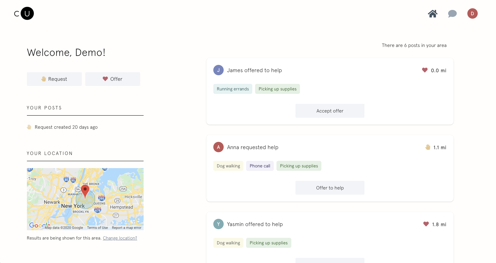
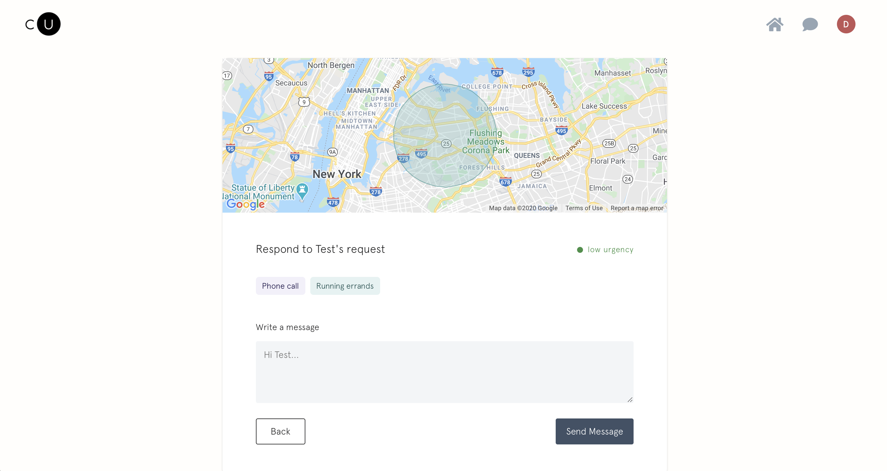
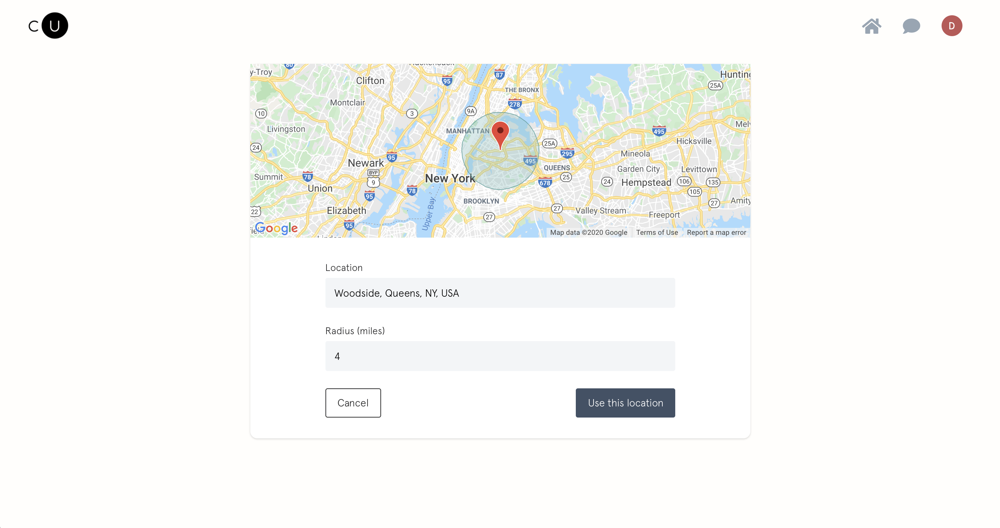
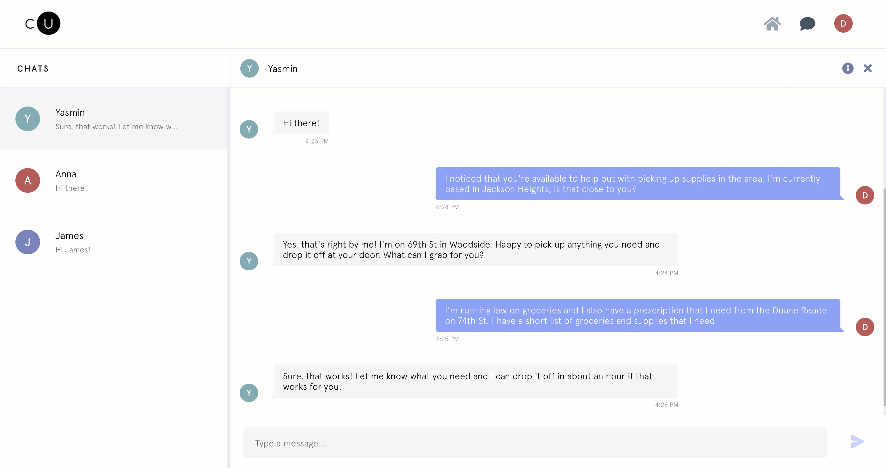
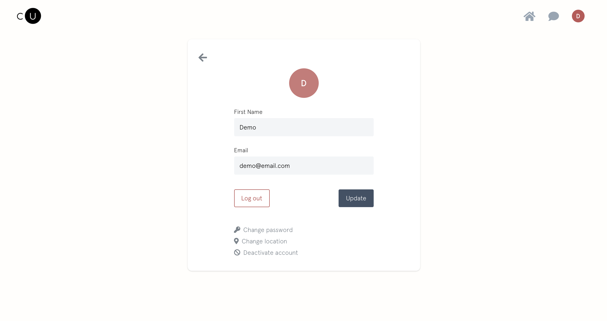

# CommUnity
Bringing communities together in a time of need

Live app: https://comm-unity.now.sh/

## Summary

Right now, more than ever, we need to unite our communities and help those in need. CommUnity is a platform that enables the sharing of services and resources to ensure no one is left stranded during the Coronavirus (COVID-19) outbreak.

Living in Woodside, Queens, one of the epicenters of the pandemic in the US, I have experienced the immense impact of the virus first hand. While it is heartbreaking to see the damage and loss that has been caused, it has been great to see my community come together to support each other. I started to see a lot of hand written signs around my apartment building and on the streets offering help to those who are in high risk categories. This inspired me to create an app that simplifies the process of getting in touch with neighbors to offer a hand or request help.  

Users can post offers to help or requests for help across a number of categories such as picking up supplies, dog walking, running errands, or a friendly chat. Each user sets their location and radius and can view and respond to posts from other users in their area. This initiates a private chat where the users can work out the details.

## Screenshots

### Home Page:

### Post Detail Page:

### Location Page:

### Chat Page:

### Account Page:

## Technologies Used

* React with CSS Modules, Context API, and React Router
* Socket.io for live chat web sockets
* Google Maps API for maps
* Jest and Enzyme for frontend testing

## Demo Account

To access the demo account, click on the "See a demo" button on the landing page. You will be automatically logged in as a demo user and able to use the app as a regular user.

## API

Server side repository can be found (here)[https://github.com/zoeferencova/community-api].
